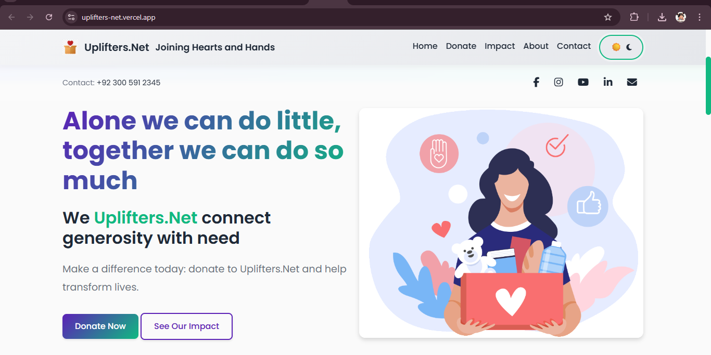
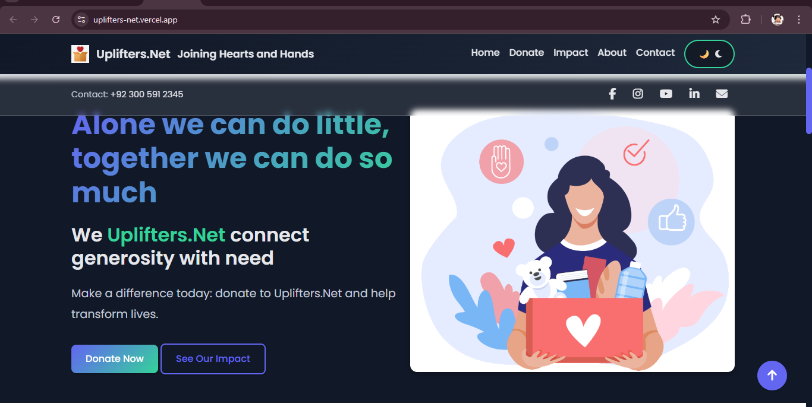
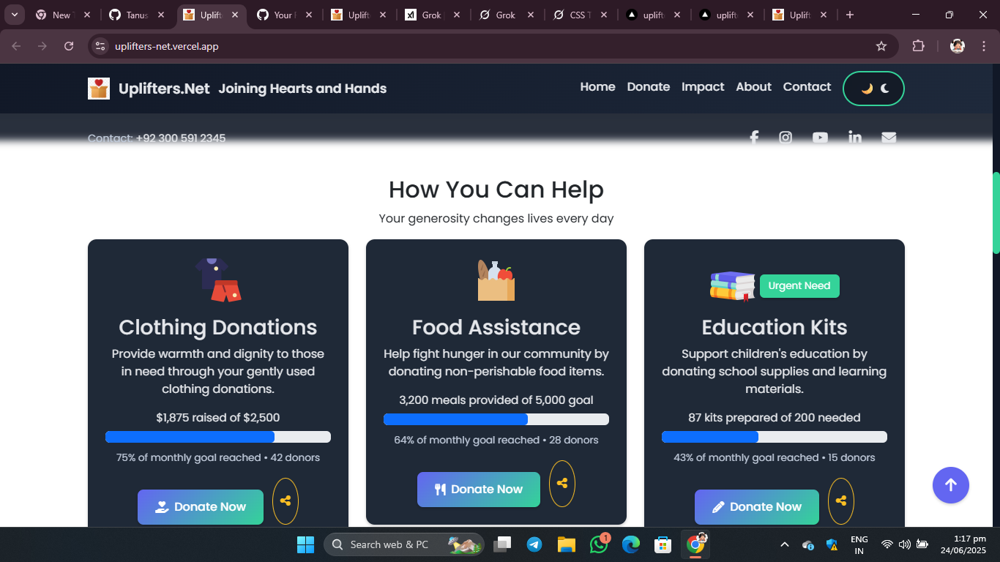
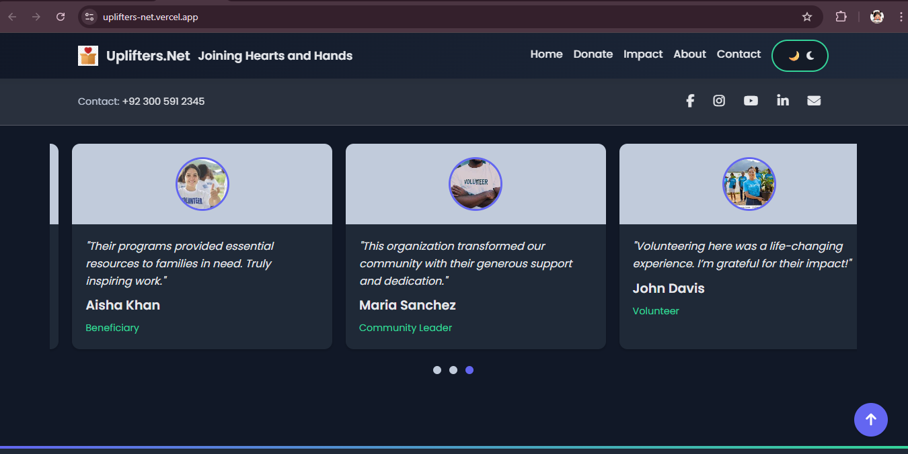

# 🌍 Uplifters.Net – *Joining Hearts and Hands*

<p align="center">
  
</p>

**Uplifters.Net** is a charity platform that connects *generosity with need*. It enables transparent and heartfelt donations of **clothing**, **food**, and **education kits**.  
Developed using **HTML**, **CSS**, and **JavaScript**, the platform features a responsive layout, a light/dark theme switcher, and interactive donation tracking.

<p align="center">
  
  
  
</p>

---

## 📋 Table of Contents
- [🌟 About](#-about)
- [✨ Features](#-features)
- [📸 Screenshots](#-screenshots)
- [🛠 Installation](#-installation)
- [🚀 Usage](#-usage)
- [🤝 Contributing](#-contributing)
- [📬 Contact](#-contact)
- [📜 License](#-license)

---

## 🌟 About

**Uplifters.Net** empowers communities by bridging those who care with those in need.  
Whether you want to donate warm clothes, provide meals, or sponsor education kits—this platform makes it simple, beautiful, and effective.

<p align="center">
  <br>
  
</p>

> *Homepage featuring our mission and call-to-action buttons.*

---

## ✨ Features

- ✅ **Responsive Design**  
  Built with Bootstrap 5 to ensure mobile, tablet, and desktop compatibility.

- 🌗 **Dark/Light Theme Toggle**  
  Switch seamlessly between themes using the navbar icon.

- 📦 **Interactive Donation Cards**  
  Real-time progress tracking for food, clothing, and education categories.

- 🖼️ **Image Gallery with Popups**  
  Browse donation impact through an engaging lightbox popup experience.

- 💬 **Testimonial Carousel**  
  Displays rotating feedback from those helped, powered by Swiper.js.

- 📊 **Animated Impact Counters**  
  Live-updating numbers show people helped, resources donated, and community growth.

---

## 📸 Screenshots

| 🏠 Home Page | 🎁 Donation Section | 📷 Gallery & Testimonials |
|-------------|----------------------|----------------------------|
|  |  |  |
| Welcoming layout with mission and action. | Trackable donation categories. | Gallery with carousel and testimonial stories. |

---

## 🛠 Installation

Want to run it locally? Super easy! 👇

### 1. Clone the Repository:
```bash
git clone https://github.com/TanushreeSarkar/uplifters-net.git
```

### 2. Navigate to the Project Folder:
```bash
cd uplifters-net
```

### 3. Open in Your Browser:
You can simply open `index.html` in your favorite browser:

- Option 1: Double-click `index.html`  
- Option 2: Use [Live Server](https://marketplace.visualstudio.com/items?itemName=ritwickdey.LiveServer) extension in VS Code for a smooth development experience

### 🔗 No External Dependencies!
All resources are loaded via CDN:
- **Bootstrap 5**
- **Font Awesome**
- **Google Fonts**

---

## 🚀 Usage

Here’s how you can explore Uplifters.Net:

| Action | How to Do It |
|--------|--------------|
| 🌐 Visit Live Site | [Click Here](https://tanushreesarkar.github.io/uplifters-net/) |
| 💝 Donate | Click on “Donate Now” (currently linked to `#contact`) |
| 🌗 Switch Theme | Click the moon/sun icon in the navbar |
| 🖼 View Gallery | Click on any gallery image for a popup view |
| 🔗 Share | Use social media buttons to spread the word |

---

## 🤝 Contributing

We welcome community contributions! Here’s how to get started:

1. **Fork** this repository.
2. Create a new branch:
   ```bash
   git checkout -b feature/your-feature-name
   ```
3. **Commit** your changes:
   ```bash
   git commit -m "Added: your feature"
   ```
4. **Push** to your fork:
   ```bash
   git push origin feature/your-feature-name
   ```
5. Open a **Pull Request**.

📄 See [CONTRIBUTING.md](CONTRIBUTING.md) for more contribution guidelines.

---

## 📬 Contact

Got questions, feedback, or want to collaborate?

- 📧 Email: [contact@uplifters.net](mailto:contact@uplifters.net)  
- 💻 GitHub: [Tanushree Sarkar](https://github.com/TanushreeSarkar)  
- 📲 Social: [Facebook](#) • [Instagram](#) • [YouTube](#) • [LinkedIn](#)

---

## 📜 License

This project is licensed under the **MIT License**.  
Please see [LICENSE](LICENSE) for usage rights.

---

> Made with ❤️ and empathy by [Tanushree Sarkar](https://github.com/TanushreeSarkar)
